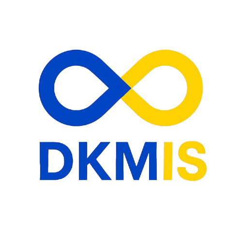
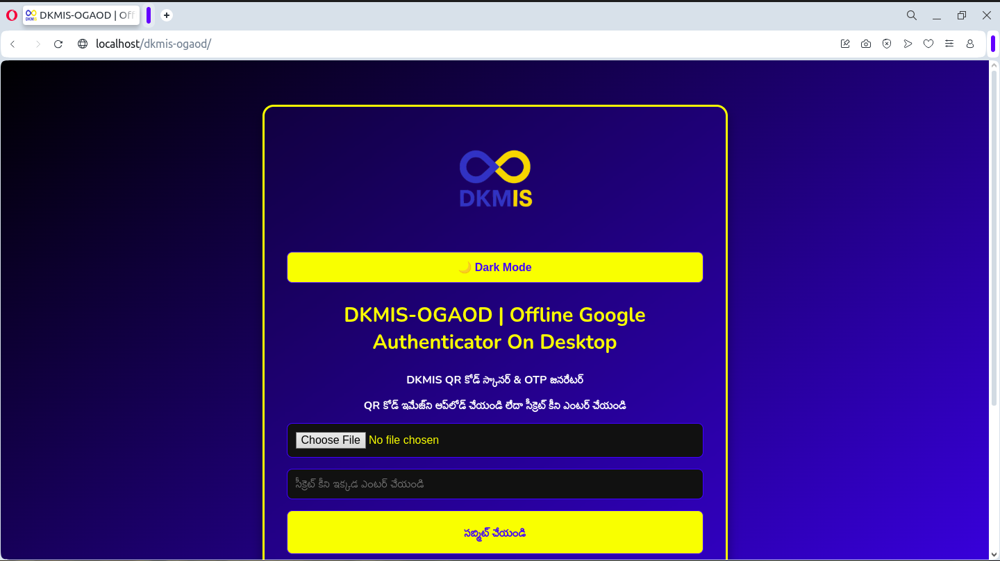
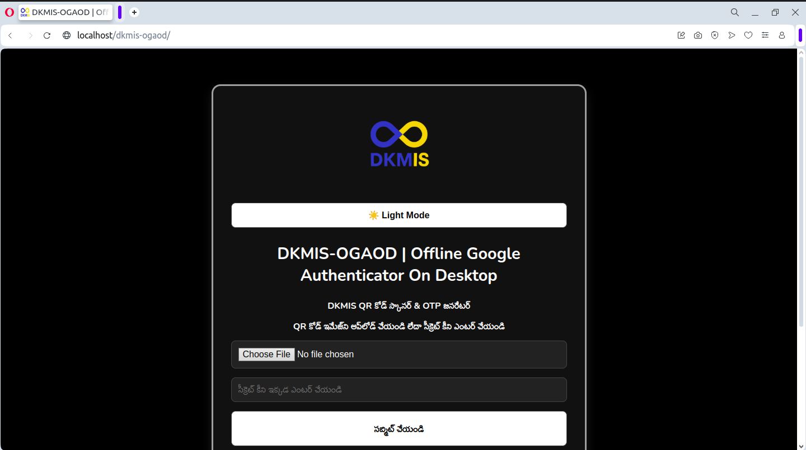
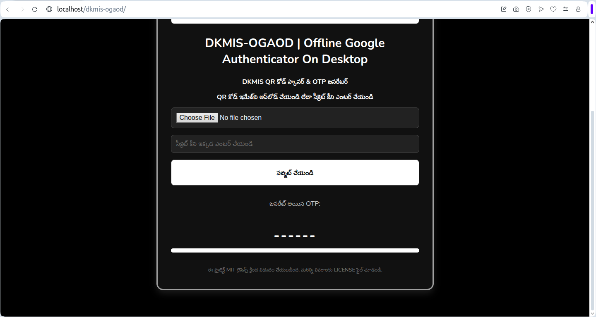

# DKMIS-OGAOD

**Offline Google Authenticator On Desktop**

DKMIS-OGAOD is a lightweight offline tool to scan QR codes or enter secret keys and generate TOTP-based one-time passwords (OTPs) — all from your desktop, without internet connection or external servers.

---

## 🔐 Features

- ✅ Offline QR Code Scanner & OTP Generator
- ✅ Upload QR code image or enter manual secret key
- ✅ Real-time OTP generation with timer
- ✅ Toggle between Light and Dark mode
- ✅ Simple, secure, and privacy-focused

---

## 🖥️ How to Use

1. Open `index.html` in your browser.
2. Upload a QR code image **OR** enter your TOTP secret key manually.
3. Click **"సబ్మిట్ చేయండి"** to generate your OTP.
4. Use the OTP in your 2FA login screen.

---

## 🌓 Dark/Light Mode

Click the toggle button 🌙/☀️ to switch between Dark Mode and Light Mode dynamically.

---

## 🔗 Official Page

Visit the official article:  
👉 [https://www.dkmis.com/article/95-DKMIS-OGAOD](https://www.dkmis.com/article/95-DKMIS-OGAOD)

---

## 🧾 License

This project is released under the [Creative Commons Attribution-NonCommercial-NoDerivatives 4.0 International Public License
](https://creativecommons.org/licenses/by-nc-nd/4.0/).

---

## 📂 Folder Structure
project/

├── index.html

├── style.css

├── style_dark_mode.css

├── js-otp.js

├── main.js

├── jsQR.min.js

├── crypto-js.min.js

├── logo.png

└── fonts/

├───── Nunito-Regular.ttf

└───── Nunito-Bold.ttf

## 📸 Screenshots

## ⚠️ Security Warning

Do not use browser extensions while using this tool (DKMIS-OGAOD).

    Some browser extensions can read, modify, or steal data from web pages — including QR codes and OTPs.

    Your QR Code / Secret Key might be exposed to malicious extensions.

    For maximum security:

        ✅ Use this tool offline only (open the HTML file locally).

        ❌ Do not use browser extensions like QR readers, password managers, or developer tools when using this page.

        ✅ Use it in a private/incognito window, or even better, on a secure desktop environment without internet access.

Stay safe – your 2FA secrets are sensitive!

## License

This project is licensed under the [Creative Commons Attribution-NonCommercial-NoDerivatives 4.0 International License](https://creativecommons.org/licenses/by-nc-nd/4.0/).

- ✅ Free for personal and educational use
- ❌ Commercial use is prohibited
- ❌ No modifications or derivative works allowed
- 📌 Proper credit to "DKMIS-OGAOD" must be given

## 🙏 Support & Donations

If you find this project helpful, consider supporting its development:

--- visit us : [DKMIS](https://www.dkmis.com) ---

Your support helps keep this project free and actively maintained.

© 2025 [DKMIS](https://www.dkmis.com)
